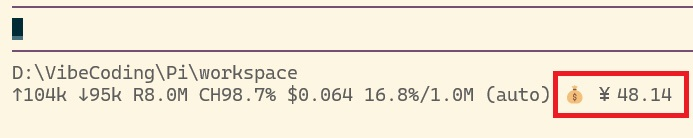

# balance

> A pi extension that shows the current model provider's account balance in the pi footer.

**English** | [简体中文](./README.zh-CN.md)



`balance` displays the account balance of the provider backing the active model, right after the context-usage indicator in pi's bottom footer (e.g. `16.8%/1.0M (auto)`).

## Features

- **Footer display** — shows the balance in the footer's stats line, just after the context usage indicator.
- **Modular backends** — the frontend only renders; each provider implements its own balance query through a dispatcher. A `deepseek` module is included; other providers fall back to a stub (shown as `💰 N/A`). If you need to show balances from other providers, you can add your own.
- **Multi-currency** — currency symbols are detected from the API response (`CNY → ￥`, `USD → $`); all currencies are shown, space-separated.
- **Configurable refresh** — default 60s, selectable 30s–300s via `/balance-interval`; persisted to `config.json` next to the extension.
- **Machine-readable output** — additionally writes a plain amount (no emoji) to `%TEMP%/pi-balance.json`, so other tools or the [pi-status-window](../../pi-status-window/) floating window can consume it.
- **Resilient state writes** — `%TEMP%/pi-balance.json` is written atomically (temp file + rename). On Windows a concurrently polling reader can hold the file open for a few microseconds, so a failed rename is retried with a short backoff (3/10/25 ms) rather than surfacing an error.
- **Bilingual** — follows the system/PI_LANG language, falling back to English (see [Language](#language--internationalization)).

## File layout

```
balance/
├── index.ts          # entry: footer rendering, refresh timer, model-switch handling, /balance-interval
├── i18n.ts           # zh/en dictionary and t()
├── config.ts         # refresh-interval config read/write (default 60s, clamped to 30s–300s)
├── config.json       # persisted config (created on first run, git-ignored)
└── providers/
    ├── index.ts      # dispatcher: provider → query module (register new providers here)
    ├── deepseek.ts   # deepseek balance query (GET /user/balance, Bearer auth)
    └── stub.ts       # placeholder for other providers (returns unsupported)
```

## Install

```bash
# From any local path (extension directory)
pi install /absolute/path/to/balance

# Relative to the current project
pi install ./balance
```

Then `/reload` in pi to activate the extension. When published on npm or git, you will also be able to:

```bash
pi install npm:@petrel-cn/balance     # or
pi install git:github.com/petrel-cn/pi-extensions-3-in-1@v1.1.0
```

> Extensions run with full system permissions. Only install sources you trust.

## Usage

| Command | Effect |
|---------|--------|
| `/balance-interval` | Interactively set the refresh interval (30s – 5 min); persisted to `config.json` |

The balance is displayed automatically in the footer. It refreshes on `session_start`, on a timer, and immediately when the model (and therefore provider) changes.

## Configuration

The extension reads `config.json` next to itself (created on first run):

```json
{
  "refreshIntervalMs": 60000
}
```

- `refreshIntervalMs` — refresh interval in milliseconds. Allowed range 30s–300s; clamped to these bounds if out of range.

## Language / Internationalization

`balance` is bilingual (Chinese / English) and self-contained. Language is resolved with the following priority:

1. `PI_LANG` environment variable (`zh` or `en`)
2. System language — POSIX env vars (`LANG` / `LC_ALL`) **or** the system ICU locale (most reliable on Windows, e.g. `zh-CN`)
3. Fallback: **English**

The `💰 Fetch failed` message (shown when a balance query fails) follows this resolution: `获取失败` in Chinese, `Fetch failed` in English. Non-Chinese users always see English.

## Dependencies

- **Weak (depends on nothing)** — `balance` uses only pi's public extension API and Node built-ins.
- **Consumed by** — writes `%TEMP%/pi-balance.json` for the [pi-status-window](../../pi-status-window/) floating window (weak); missing it does not affect the footer display.
- Runtime deps: `@earendil-works/pi-coding-agent`, `@earendil-works/pi-tui` (provided by pi; list in `peerDependencies`).

## Compatibility

- pi version: tested against `0.84.x` (uses `setFooter`, `modelRegistry.getProviderAuth`).
- Node.js: `>= 20`.

## Non-interactive mode

- `ctx.ui.setFooter` renders nothing outside TUI mode (`json` / `print` / `rpc`), so the footer produces no output there.
- Balance queries, the refresh timer and the `%TEMP%/pi-balance.json` write do not depend on the UI and behave the same.

## Notes

- The balance query is `GET {baseUrl}/user/balance`; the API key is resolved from pi's credential store (`ctx.modelRegistry.getProviderAuth`) and is never hard-coded.
- Failed queries show `💰 Fetch failed` in a warning colour; a missing key or an unsupported provider shows `💰 N/A`.
- The cache-hit rate is computed over the whole session as `cacheRead / (input + cacheRead + cacheWrite)`, consistent with `pi-status`.

## Implementation note

`balance` replaces pi's built-in footer via `ctx.ui.setFooter()`. The pi footer is **globally unique** — only one custom footer is active at a time. If another extension also calls `setFooter()`, they overwrite each other (the later-loaded one wins) and one of them loses its display. Extensions that render a footer should either cooperate within a single footer component or explicitly disable/replace `balance` to avoid conflicts.

## License

[MIT](../LICENSE) — free to use, modify, and redistribute.
