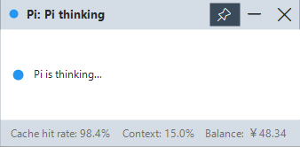

# pi-status-window

> A Windows floating window that shows the live running state of pi on your desktop.

**English** | [简体中文](./README.zh-CN.md)

The companion app to the [pi-status](../pi-status/) extension. It polls the status JSON that the extension writes and displays a small, always-on-top overlay so you can see what pi is doing without switching to the terminal.

## Screenshots

| State | Description |
|------|--------|
|  | Idle — waiting for your instruction |
|  | Thinking — pi is thinking… |

The title bar shows the current state; the pinned dot color indicates the state (yellow = asking, red = approval, green = done). The data panel below shows cache hit rate, context usage, and balance.

## Architecture

```
pi-status (extension)  ──writes──▶  %TEMP%/pi-status.json      ─┐
balance (extension)    ──writes──▶  %TEMP%/pi-balance.json    ──┤  polls 300ms
                                                                ▼
                                                    pi-status-window.exe
```

## Build

Uses the built-in .NET Framework compiler on Windows — no SDK required:

```bat
build.cmd
```

Outputs `bin\pi-status-window.exe`. Windows 10/11 ship with the .NET Framework 4.8 runtime, so the built exe runs with zero dependencies.

## Download

You can also grab a pre-built exe from the [Releases](https://github.com/petrel-cn/pi-extensions/releases) page — download it and run it. No build or runtime setup needed.

## Use

```bat
pi-status-window.exe          # Open the floating window (single instance; re-running just brings it forward)
```

The window is always-on-top. Pin, minimize, and close buttons are in the top-right. Window size / position / pin state are persisted to `%APPDATA%/pi-status-window/config.json`.

## Status states

| State | Trigger | Dot |
|-------|---------|-----|
| idle | no activity after `session_start` | none |
| thinking | `agent_start` / `thinking_delta` | none |
| working | `text_delta` / `tool_execution_start` | none |
| asking | `ask_question` tool | yellow |
| approval | dangerous bash pattern (heuristic) | red |
| done | `agent_settled` | green |

## Icons

Uses the built-in Segoe Fluent Icons font (`SegoeIcons.ttf`) — no external assets: pin `E718`, minimize `E921`, restore `E923`, close `E8BB`.

## Notes

- In exclusive full-screen games the normal always-on-top window can be hidden (DWM is bypassed); in that case a tray bubble is shown at most once per 60s. Borderless full-screen (the modern default) works normally.
- Balance data comes from the [balance](../balance/) extension; without it, or on a failed query, the window shows "balance unavailable".

## License

[MIT](../LICENSE) — free to use, modify, and redistribute.
