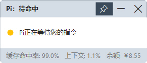
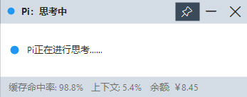

# pi-status-window

> 一个在桌面上实时显示 pi 运行状态的 Windows 悬浮窗程序。

**简体中文** | [English](./README.md)

这是 `pi-status` 扩展的配套程序。它轮询扩展写入的状态 JSON，以一个小型、置顶的悬浮窗显示 pi 正在做什么，无需切回终端即可一目了然。

## 截图

| 状态 | 说明 |
|------|------|
|  | 待命中 —— Pi 正在等待您的指令 |
|  | 思考中 —— Pi 正在进行思考… |

标题栏显示当前状态；状态圆点（标题栏与内容区左侧各一个）共有五种颜色——🟡 黄 = 等待、🔵 蓝 = 思考、🟢 绿 = 工具调用、🔴 红 = 命令审批、⚪ 灰 = 已退出。下方数据显示缓存命中率、上下文与余额。

## 架构

```
pi-status 扩展  ──写──▶  %TEMP%/pi-status.json    ─┐
balance  扩展   ──写──▶  %TEMP%/pi-balance.json  ──┤ 轮询 300ms
                                                   ▼
                                        pi-status-window.exe
```

## 构建

使用 Windows 自带的 .NET Framework 编译器，无需 SDK：

```bat
build.cmd
```

输出 `bin\pi-status-window.exe`。Windows 10/11 自带 .NET Framework 4.8 运行时，编译出的 exe 零依赖可直接运行。

## 下载

也可以直接从 [Releases](https://github.com/petrel-cn/pi-extensions-3-in-1/releases) 页面下载预编译的 exe —— 下载后直接运行即可，无需构建或安装运行时。

## 使用

```bat
pi-status-window.exe          # 打开悬浮窗（单实例；重复运行仅唤起已有实例）
```

窗口置顶。右上角为图钉、最小化、关闭按钮。窗口尺寸 / 位置 / 置顶状态持久化到 `%APPDATA%/pi-status-window/config.json`。

## 状态圆点

五种状态对应五种颜色。圆点在标题栏（标题文字前）与内容区（说明文字前）各绘制一个。

| 圆点 | 状态 | 含义 | 触发 |
|------|------|------|------|
| 🟡 黄 `#FFC107` | idle | 等待中，等待您的指令 | `session_start` / `agent_settled` 后无活动 |
| 🔵 蓝 `#2196F3` | thinking | 正在思考 | `agent_start` / `thinking_delta` |
| 🟢 绿 `#43A047` | working | 正在调用工具 / 输出 | `text_delta` / `toolcall_*` / `tool_execution_start` |
| 🔴 红 `#E53935` | approval | 需要命令审批 | 危险 bash 模式（启发式）/ 审批弹窗 |
| ⚪ 灰 `#9E9E9E` | closed | Pi 已退出 | `session_shutdown`，或心跳超过 15 秒未更新 |

`asking` 状态（`ask_question` 工具）已并入 `idle`，因此提问待确认时显示黄点。工作状态会按动作细分标题与正文（读文件 / 写文件 / 编辑 / 搜索 / 调用工具）。

## 图标

使用系统自带 Segoe Fluent Icons 图标字体（`SegoeIcons.ttf`），零外部素材：图钉 `E718`、最小化 `E921`、还原 `E923`、关闭 `E8BB`。

## 说明

- 独占全屏游戏下普通置顶窗口不可见（DWM 被绕过），此时每 60 秒最多弹一次托盘气泡提醒；无边框全屏（现代游戏默认）可正常显示。
- 余额数据来自 [balance](../balance/) 扩展；未启用或查询失败时显示「余额不可用」。

## 许可协议

[MIT](../LICENSE) —— 允许自由使用、修改与再分发。
