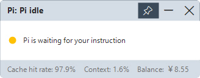

# pi-status

> A pi extension that records the live running state of pi and exposes it as machine-readable JSON, for a desktop floating window.

**English** | [简体中文](./README.zh-CN.md)



`pi-status` subscribes to pi's session / agent / tool events and writes the current state to `%TEMP%/pi-status.json`. A companion Windows app, [pi-status-window](../pi-status-window/), polls that file and shows the status as a floating overlay on your desktop.

## What it does

The extension is the **data producer**: it listens to pi's lifecycle and translates it into a small, structured status object that any program can consume. It has no UI of its own — the visible window is the separate [pi-status-window](../pi-status-window/) app.

## File layout

```
pi-status/
├── index.ts      # entry: event subscriptions, state machine, atomic JSON write, /pi-status command
├── config.json   # language config (written by /pi-status zh|en, auto-generated, git-ignored)
├── README.md     # this file
└── CHANGELOG.md  # change history
```

## State machine

```
idle → thinking → working → asking / approval → done
```

| Status | Trigger |
|--------|---------|
| `idle` | no activity since `session_start` |
| `thinking` | `agent_start` / `thinking_delta` |
| `working` | `text_delta` (code output) / `tool_execution_start` |
| `asking` | the `ask_question` tool is called |
| `approval` | dangerous bash pattern (heuristic) + event-bus collaboration with workspace-guard |
| `done` | `agent_settled` |

The summary distinguishes the active action: `read` / `write` / `edit` / `search` / `tool` / `output`.

## Data panel

The data panel shows:

- **Cache hit rate** — `cacheRead / (input + cacheRead + cacheWrite)`.
- **Context** — `ctx.getContextUsage().percent`.
- **Balance** — read from the `%TEMP%/pi-balance.json` written by the [balance](../balance/) extension (this extension does not produce the balance itself).

## Install

```bash
# From any local path (extension directory)
pi install /absolute/path/to/pi-status

# Relative to the current project
pi install ./pi-status
```

Then `/reload` in pi to activate. When published on npm or git, you will also be able to:

```bash
pi install npm:@petrel-cn/pi-status     # or
pi install git:github.com/petrel-cn/pi-extensions-3-in-1@v1
```

> Extensions run with full system permissions. Only install sources you trust.

## Usage

| Command | Effect |
|---------|--------|
| `/pi-status` | Show usage (including language switching) |
| `/pi-status en` | Switch to English (default) |
| `/pi-status zh` | Switch to Chinese |

The language is persisted to `config.json` next to the extension.

## Status JSON format

```json
{
  "status": "working",
  "language": "en",
  "summary": { "action": "tool", "name": "npm test -- --watch" },
  "cacheHitRate": 58.8,
  "contextPercent": 15,
  "ts": 1750000000000
}
```

- `summary` is a semantic structure, localized by the floating window using the current `language`.
- Writes are atomic (temp file + rename) so the floating window never reads a partial JSON. A rename that fails because the polling reader is holding the file open is retried with a short backoff (3/10/25 ms).
- While pi is running, the file's timestamp is refreshed every 5 seconds (heartbeat), so a consumer can detect a killed or crashed pi without relying on event ordering.

## Language / Internationalization

The extension's command descriptions and the status `language` field follow the same resolution as the other extensions:

1. `PI_LANG` environment variable (`zh` or `en`)
2. System language — POSIX env vars (`LANG` / `LC_ALL`) **or** the system ICU locale (most reliable on Windows, e.g. `zh-CN`)
3. Fallback: **English**

The `language` field tells the floating window which locale to render the summary in.

## Dependencies

- **Weak (depends on nothing)** — uses only pi's public extension API and Node built-ins.
- **Breaks the** `%TEMP%/pi-balance.json` **contract** — reads the balance written by the [balance](../balance/) extension (weak: missing it shows "balance unavailable").
- **Listens to** — `pi-status:approval` / `pi-status:approval-end` events broadcast by [workspace-guard](../workspace-guard/) (weak: falls back to heuristic detection).
- **Consumed by** — the [pi-status-window](../pi-status-window/) floating window app.
- Runtime deps: `@earendil-works/pi-coding-agent` (provided by pi; list in `peerDependencies`).

## Non-interactive mode

The extension uses no UI API (`notify` / `setStatus` / `setWidget` / `setFooter`), so status writing keeps working under `json` / `print` / `rpc`.

## Compatibility

- pi version: tested against `0.84.x`.
- Node.js: `>= 20`.

## Notes

- Approval state prefers the `pi-status:approval` event bus from [workspace-guard](../workspace-guard/); without that extension it falls back to heuristic detection of dangerous bash commands, which is less timely.
- Balance data is produced by the [balance](../balance/) extension; this extension never queries an API itself.
- The floating window is a separate project and is deployed on its own.
- The rename retry sleeps synchronously via `Atomics.wait`, whose resolution is bounded by the system timer (about 15 ms on Windows). In the worst case (three consecutive failures) the main thread is blocked for roughly 40–60 ms; with a heartbeat every 5 s this is not observable in practice.

## License

[MIT](../LICENSE) — free to use, modify, and redistribute.
