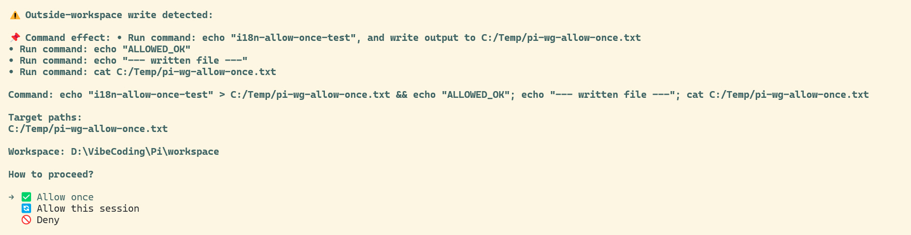
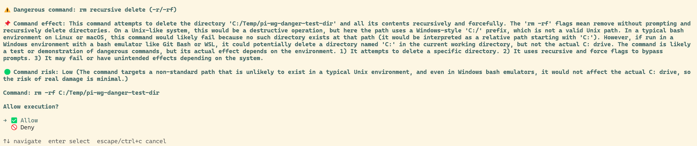

# workspace-guard

> A pi extension that keeps file writes within the current workspace, prompting for approval on anything outside it.

**English** | [简体中文](./README.zh-CN.md)

## What it does

`workspace-guard` constrains write operations to the current workspace (the session `cwd`). Anything that would write outside the workspace — or a dangerous command anywhere — requires your approval first.

## File layout

```
workspace-guard/
├── index.ts     # entry: interception logic, /wsguard and lang commands, approval UI, LLM explanation
├── core.ts      # pure helpers: path checks, bash write-target extraction (quote-aware/MSYS), dangerous patterns, local templates, prompt clamping
├── i18n.ts      # language resolution (PI_LANG / system / English fallback) + zh/en dictionary and t()
├── config.json  # user config: language + extra audit rules, auto-generated, git-ignored
├── state.json   # on/off memory written by /wsguard on|off, auto-generated, git-ignored
├── README.md    # this file
└── CHANGELOG.md # change history
```

## Approval dialogs

<details>
<summary>Outside-workspace write (English)</summary>



</details>

<details>
<summary>Dangerous command (English)</summary>



</details>

## Features

- **`write` / `edit` tools** — the target path must be inside the workspace, otherwise an approval prompt appears. Denying it blocks the write.
- **`bash` tool** — detects write targets in the command (redirects `>`, `>>`, and `cp`/`mv`/`rm`/`mkdir`/`touch`/`tee`/`install`/`dd`/`ln`). Targets outside the workspace prompt for approval.
- **Dangerous-command protection** — `rm -r/-rf`, `sudo`, and `chmod/chown 777` require confirmation regardless of whether they stay inside the workspace.
- **LLM explanation + risk assessment** — for dangerous commands, an LLM (reusing the current session's model and credentials, nothing hard-coded) generates a natural-language explanation and a risk level. On failure/timeout/no model it falls back to a local template.
- **Custom audit rules** — the optional `llmExtraRules` field in `config.json` appends your own rules to the audit prompt (see [Configuration](#configuration)).
- **Bounded approval prompts** — dialog contents are clamped so even a command hundreds of lines long is readable: the command preview (and the target-path list) shows the **first 16 lines, an omission marker and the last 3 lines** (20 lines or fewer are shown in full), while the LLM explanation is never re-wrapped by the extension — the terminal wraps it, and it is only cut beyond 1000 characters (a safety valve).
- **Non-interactive mode** (print/json/rpc, no UI) — outside-workspace writes and dangerous commands are always rejected.
- **Session approval cache** — "Allow this session" keeps a path/command approved for the rest of the current session.
- **Bilingual** — the whole UI follows the system/PI_LANG language, falling back to English.

## Install

```bash
# From any local path (extension directory)
pi install /absolute/path/to/workspace-guard

# Relative to the current project
pi install ./workspace-guard
```

Then `/reload` in pi to activate. When published on npm or git, you will also be able to:

```bash
pi install npm:@petrel-cn/workspace-guard     # or
pi install git:github.com/petrel-cn/pi-extensions-3-in-1@v1.1.0
```

> Extensions run with full system permissions. Only install sources you trust.

## Usage

| Command | Effect |
|---------|--------|
| `/wsguard` | Show current status |
| `/wsguard on` | Enable approval (enabled by default) |
| `/wsguard off` | Disable approval (writes no longer intercepted) |
| `/wsguard lang zh` / `/wsguard lang en` | Switch UI language (persisted to `config.json`) |

**Status priority**: environment variable `PI_WORKSPACE_GUARD` (`off`/`0`/`false`/`no` disables) > `state.json` memory > default enabled.

## Configuration

### Environment variables

| Variable | Effect |
|----------|--------|
| `PI_WORKSPACE_GUARD` | `off`/`0`/`false`/`no` disables the guard; `on`/`1`/`true`/`yes` enables |
| `PI_WORKSPACE_GUARD_LLM` | `off` disables the LLM explanation (falls back to the local template) |
| `PI_ALLOW_WRITE_DIRS` | Extra directories always allowed (multiple separated by the OS path delimiter — `;` on Windows) |
| `PI_LANG` | `zh` or `en` — override the UI language |

The extension also reads `state.json` (enabled flag) and `config.json` (language) next to itself, both auto-generated on first use.

### `config.json`

| Field | Type | Default | Effect |
|-------|------|---------|--------|
| `language` | `"zh"` \| `"en"` | from `PI_LANG` / system locale | UI and prompt language, written by `/wsguard lang` |
| `llmExtraRules` | `string[]` | none | Extra audit rules appended to the dangerous-command LLM system prompt |

`llmExtraRules` entries are appended verbatim — one bullet per entry — to the end of the dangerous-command audit prompt, under a dedicated section stating that it takes precedence over the rest of the prompt. That makes it possible to inject a deployment-specific risk policy (for example "deletions under `/srv/scratch/` are always low risk") without patching the extension source. Entries that are not non-empty strings are ignored, and the field is never overwritten by `/wsguard lang`.

## Language / Internationalization

The approval UI, command descriptions, LLM prompt, risk labels, and local templates are all bilingual. Language resolution priority:

1. `PI_LANG` environment variable (`zh` or `en`)
2. Persisted language in `config.json` (set via `/wsguard lang`)
3. System language — POSIX env vars (`LANG` / `LC_ALL`) **or** the system ICU locale (most reliable on Windows, e.g. `zh-CN`)
4. Fallback: **English**

The LLM system prompt requests Chinese `低/中/高` or English `low/medium/high` depending on the language; the risk parser accepts both and normalizes to `low/medium/high`, displayed per the current language.

## Dependencies

- **Weak (depends on nothing)** — uses only pi's public extension API and Node built-ins.
- **Broadcasts to** — emits `pi-status:approval` / `pi-status:approval-end` events so the [pi-status-window](../../pi-status-window/) floating window can show an "approval pending" state (weak; missing it does not affect approval itself).
- Runtime deps: `@earendil-works/pi-coding-agent` (provided by pi; list in `peerDependencies`).

## Compatibility

- pi version: tested against `0.84.1+`.
- Node.js: `>= 20`.

## Notes

- Device files (`/dev/*`, `nul`) are not treated as disk writes and do not trigger approval.
- Paths containing variables or command substitutions are skipped (cannot be statically analyzed).
- `git`/`npm`/`yarn`/`pnpm`/`pip` subcommands get a natural-language explanation from the local template.
- Approval prompts are clamped by a fixed policy (v2.6): the command block shows the first 16 lines plus the last 3 (20 lines or fewer in full), path lists use the same rule, and prose is only cut beyond 1000 characters. The omitted middle of a command is not shown in the dialog.
- No width handling is performed: a single extremely long command line is wrapped by the terminal and can occupy many rows, so on very small terminals a prompt may still exceed the screen.
- `config.json` (language + extra audit rules) and `state.json` (on/off memory) are auto-generated on first use. Back up `config.json` before an overwriting upgrade if you have custom `llmExtraRules`.

## License

[MIT](../LICENSE) — free to use, modify, and redistribute.
