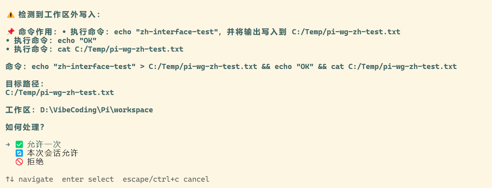
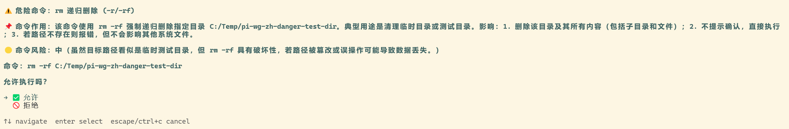

# workspace-guard

> 一个将写文件操作约束在当前工作区内、对工作区外写入要求审批的 pi 扩展。

**简体中文** | [English](./README.md)

## 作用

`workspace-guard` 将写操作约束在当前工作区（会话 `cwd`）内。任何工作区外的写入——或任意位置的危险命令——都需要你先审批。

## 审批弹窗

<details>
<summary>工作区外写入（中文）</summary>



</details>

<details>
<summary>危险命令（中文）</summary>



</details>

## 特性

- **`write` / `edit` 工具** —— 目标路径必须在工作区内，否则弹出审批；拒绝则拦截（block）。
- **`bash` 工具** —— 检测命令中的写目标（重定向 `>`、`>>`，以及 `cp`/`mv`/`rm`/`mkdir`/`touch`/`tee`/`install`/`dd`/`ln`），工作区外目标弹出审批。
- **危险命令防护** —— `rm -r/-rf`、`sudo`、`chmod/chown 777` 无论是否在工作区内都要求确认。
- **LLM 说明 + 风险评估** —— 危险命令由 LLM（复用当前会话的模型与认证，零硬编码）生成自然语言说明 + 风险等级；失败/超时/无模型时降级到本地模板。
- **非交互模式**（print/json/rpc，无 UI）—— 工作区外写入与危险命令一律拒绝。
- **会话批准缓存** —— 「本次会话允许」的路径/命令在当前会话内不再重复询问。
- **双语** —— 界面整体跟随系统 / `PI_LANG` 语言，兜底英文。

## 安装

```bash
# 任意本地路径（扩展目录）
pi install /absolute/path/to/workspace-guard

# 相对当前项目
pi install ./workspace-guard
```

然后在 pi 中 `/reload` 激活。发布到 npm 或 git 后，也可：

```bash
pi install npm:@petrel-cn/workspace-guard     # 或
pi install git:github.com/petrel-cn/pi-extensions@v1
```

> 扩展拥有完整系统权限。仅安装来源可信的扩展。

## 使用

| 命令 | 作用 |
|------|------|
| `/wsguard` | 查看当前状态 |
| `/wsguard on` | 启用审批（默认开启） |
| `/wsguard off` | 关闭审批（写操作不再拦截） |
| `/wsguard lang zh` / `/wsguard lang en` | 切换界面语言（持久化到 config.json） |

**状态优先级**：环境变量 `PI_WORKSPACE_GUARD`（`off`/`0`/`false`/`no` 关闭）> `state.json` 记忆 > 默认开启。

## 配置

### 环境变量

| 变量 | 作用 |
|------|------|
| `PI_WORKSPACE_GUARD` | `off`/`0`/`false`/`no` 关闭防护；`on`/`1`/`true`/`yes` 启用 |
| `PI_WORKSPACE_GUARD_LLM` | `off` 关闭 LLM 说明（回退本地模板） |
| `PI_ALLOW_WRITE_DIRS` | 额外始终允许的目录（多个用系统路径分隔符分隔，Windows 为 `;`） |
| `PI_LANG` | `zh` 或 `en` —— 覆盖界面语言 |

扩展自身旁的 `state.json`（开关标志）与 `config.json`（语言）也在首次使用时自动生成。

## 语言与国际化

审批界面、命令描述、LLM 提示词、风险标签、本地模板全部双语。语言解析优先级：

1. `PI_LANG` 环境变量（`zh` 或 `en`）
2. `config.json` 中的持久化语言（通过 `/wsguard lang` 设置）
3. 系统语言 —— POSIX 环境变量（`LANG` / `LC_ALL`）**或** 系统 ICU locale（Windows 上无 `LANG` 时最可靠，如 `zh-CN`）
4. 兜底：**英文**

LLM 系统提示词按语言要求输出中文 `低/中/高` 或英文 `low/medium/high`；风险解析同时识别两者并归一化为 `low/medium/high`，按当前语言显示。

## 依赖关系

- **弱依赖（不依赖任何扩展）** —— 仅使用 pi 的公开扩展 API 与 Node 内置模块。
- **对外广播** —— 发出 `pi-status:approval` / `pi-status:approval-end` 事件，供 [pi-status-window](../../pi-status-window/) 悬浮窗显示「需要审批」状态（弱依赖；缺失不影响审批本身）。
- 运行时依赖：`@earendil-works/pi-coding-agent`（由 pi 提供；列出在 `peerDependencies`）。

## 兼容性

- pi 版本：已在 `0.84.1+` 上测试。
- Node.js：`>= 20`。

## 说明

- 设备文件（`/dev/*`、`nul`）不视为磁盘写入，不触发审批。
- 含变量或命令替换的路径跳过（无法静态分析）。
- `git`/`npm`/`yarn`/`pnpm`/`pip` 子命令由本地模板生成自然语言说明。

## 许可协议

[MIT](../LICENSE) —— 允许自由使用、修改与再分发。
